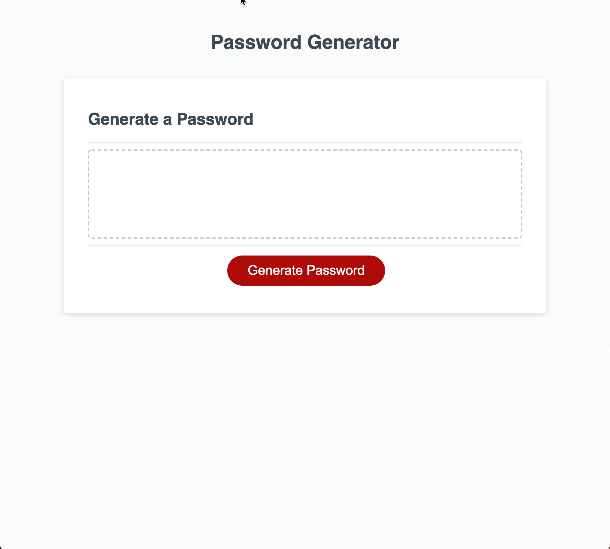

# Password Generator

## Description
Application will generate a random password based on user-selected criteria. This app will run in the browser and feature dynamically updated HTML and CSS powered by JavaScript code. It also features a clean and polished responsive user interface, ensuring that it adapts to multiple screen sizes. User will be able to select Upper and/or LowerCase Letters, Numbers, and Special Characters and decide on a password length of 8 to 128 characters.

## Badges
N/A

## Visuals
  

## Installation
Code was created with Visual Studio Code and HomeBrew.

## Usage
Portfolio and Educational purposes.

## Support
Contact:  Sherri Winslow
Email:  swinslowcoding@gmail.com

## Roadmap
Single release for Portfolio and Educational purposes.

## Contributing
Although, contributions are not allowed, at this time.  You may send any feedback on the code to swinslowcoding@gmail.com

## Authors and Acknowledgments
Author: Sherri Winslow.
Acknowledgements:  I would like to express my appreciation to my Tutor - Sandra Smith; Instructor - Dan Seskey; and TAs - Matt Torcellini, Symone Varnado, Nathan Sartain, and Jaime Montero who have been instrumental in keeping me on track and supporting me, while providing a quality education through UConn.

## License
For Educational purposes and Portfolio use.